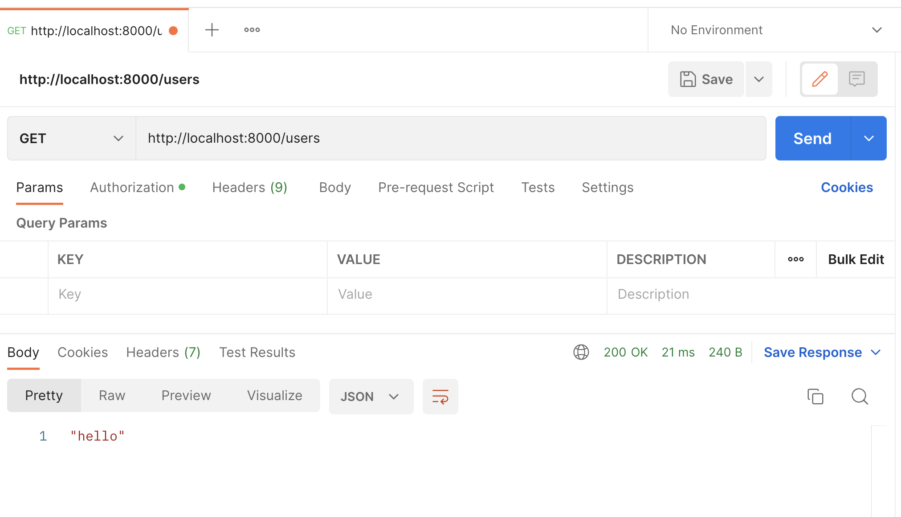

# Express Introduction

In this assignment, you will create a server using Express

## How to run project

1. Step 1: yarn
2. Step 2: yarn start

## Requirements

1. Create a serve in `index.ts` file

## Screenshots

